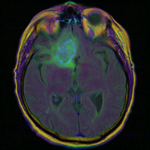

# CerebroNet

Brain MRI segmentation for anomaly detection using deep learning. The system performs pixel-level semantic segmentation to identify abnormal tissue regions in brain MRI scans.

## Overview

CerebroNet implements a transfer learning pipeline for brain MRI semantic segmentation. It supports six pre-trained segmentation architectures and includes custom loss functions designed for medical image segmentation with class imbalance.

## Supported Architectures

| Architecture | Backbone | Parameters |
|-------------|----------|------------|
| DeepLabV3 | MobileNet V3 Large | ~11M |
| DeepLabV3 | ResNet-50 | ~40M |
| DeepLabV3 | ResNet-101 | ~59M |
| FCN | ResNet-50 | ~33M |
| FCN | ResNet-101 | ~52M |
| LRASPP | MobileNet V3 Large | ~3M |

## Loss Functions

The project implements three specialized loss functions for segmentation:

- **Dice Loss** — overlap-based metric, robust to class imbalance
- **Focal Loss** — down-weights easy examples, focuses on hard pixels
- **Jaccard Loss** — IoU-based loss for boundary-aware segmentation

## Dataset

[LGG MRI Segmentation](https://www.kaggle.com/datasets/mateuszbuda/lgg-mri-segmentation) from Kaggle — brain MRI images (256×256) with corresponding binary segmentation masks.

<p align="center">
  
  
</p>

## Project Structure

```
├── src/
│   ├── dataset.py                # PyTorch Dataset for brain MRI pairs
│   ├── models.py                 # Model factory with pretrained weights
│   ├── config.py                 # Architecture registry
│   ├── losses.py                 # Loss functions and evaluation metrics
│   └── training.py               # Training loop and inference pipeline
├── notebooks/
│   ├── eda.ipynb                 # Exploratory data analysis
│   └── training.ipynb            # Model training and evaluation
└── assets/                       # Sample MRI and segmentation masks
```

## Training

```python
model, preprocess = get_image_segmentation_model(
    "deeplabv3_resnet101", num_classes=1, pretrained=True, freeze=True
)
```

Configuration:
- **Epochs**: 10
- **Batch size**: 12
- **Loss**: DiceLoss / FocalLoss / JaccardLoss
- **Optimizer**: Adam
- **Scheduler**: ExponentialLR (γ=0.95) + MultiStepLR
- **Metrics**: Pixelwise Accuracy, Mean IoU

## Inference

The inference pipeline outputs three visualizations:
1. Original MRI image
2. Prediction heatmap
3. Segmentation overlay on original (alpha blending)

## Pre-trained Weights

| Model | Download |
|-------|----------|
| DeepLabV3 ResNet-101 | [Google Drive](https://drive.google.com/file/d/1a8cncF0kSGEZK9saVuorTik3SkEwsXCi/view?usp=sharing) |

## Requirements

- Python 3.10+
- PyTorch 2.0+
- torchvision
- numpy
- scikit-learn
- Pillow
- tqdm

## License

MIT
