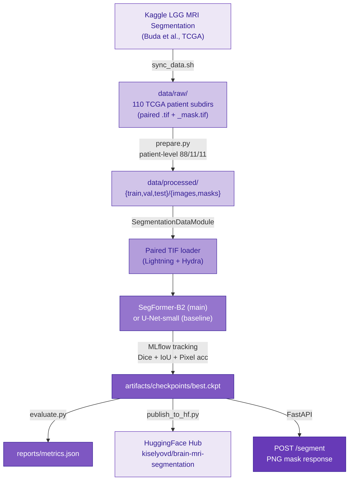

# Architecture

## Data flow

## Model choices

- **Main — SegFormer-B2.** Hierarchical transformer encoder (`nvidia/segformer-b2-finetuned-ade-512-512`, ~25 M params) with a lightweight MLP decoder. Global self-attention captures long-range texture dependencies critical in MRI — tumor regions often lack sharp boundaries and require context beyond local receptive fields. Fine-tuned with the binary segmentation head replaced.
- **Baseline — U-Net (hand-rolled).** Classic encoder-decoder with skip connections; 4 levels, 32→256 channels, ~1.9 M params. The dominant architecture in medical image segmentation literature. Serves as a meaningful upper bound for CNN-only methods; the main model must beat it to justify the transformer overhead.

## Metrics

| Metric | Why |
|---|---|
| Dice coefficient | Primary metric — measures overlap quality; penalises both false positives and false negatives equally |
| IoU (Jaccard) | Strict overlap; harder to game than Dice; standard in segmentation benchmarks |
| Pixel accuracy | Sanity check — trivially high when background dominates, so not used for model selection |

Dice is used for early stopping and checkpoint selection. Pixel accuracy is logged but not reported as headline performance because the class imbalance (tumor pixels are a small fraction of each slice) makes it an unreliable indicator.

## Key conventions

- Patient-level split prevents data leakage — all slices from one patient stay in the same partition.
- Images resized to 256 × 256 before the model; masks binarised at 0.5 threshold.
- Checkpoint stores `model_name` in hyperparameters so `inference.load_model` can rebuild the backbone without caller-supplied metadata.
- Lightning trainer seed-controlled via Hydra `seed`; deterministic mode on.
