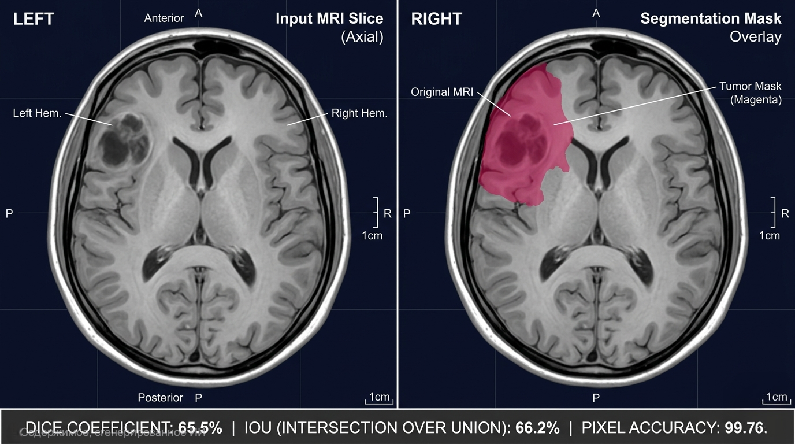
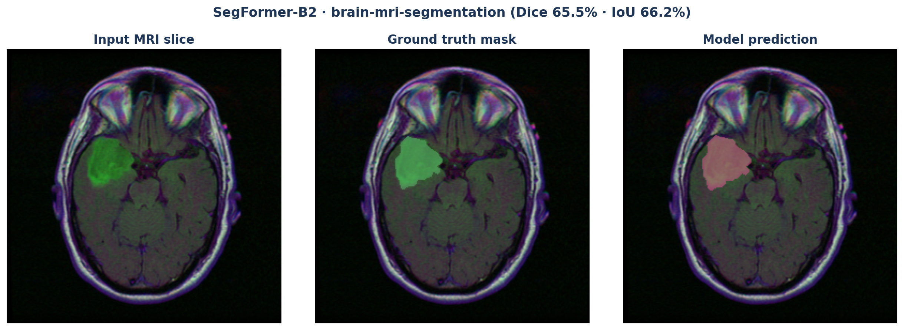

# brain-mri-segmentation

Production-grade binary semantic segmentation of brain tumors from MRI scans — pixel-level mask prediction for low-grade glioma (LGG) regions.

## Overview

| | |
|---|---|
| **Task** | Binary semantic segmentation (tumor vs. background) |
| **Dataset** | [Mateusz Buda LGG MRI (TCGA)](https://www.kaggle.com/datasets/mateuszbuda/lgg-mri-segmentation) — 110 patients, 3 929 paired slices |
| **Main model** | SegFormer-B2 (`nvidia/segformer-b2-finetuned-ade-512-512`, ~25 M params) |
| **Baseline** | Small U-Net (4 levels, 32→256 ch, ~1.9 M params, hand-rolled) |
| **Stack** | PyTorch Lightning · Hydra · MLflow · DVC · FastAPI · Docker · GitHub Actions · MkDocs |
| **License** | MIT |

## Sections

- [Architecture](architecture.md) — data flow, model choices, metrics rationale
- [Training](training.md) — running experiments, logging, overrides
- [Serving](serving.md) — FastAPI endpoints, Docker deployment
- [Benchmarks](BENCHMARKS.md) — vs literature, trade-offs
- [Reproducibility](REPRODUCIBILITY.md) — pinned environment, one-command re-run
- [Limitations](LIMITATIONS.md) — failure modes, dataset bias
- [Model card](model_card.md.j2) — HF Hub card template

## Links

- **Code:** [GitHub](https://github.com/kiselyovd/brain-mri-segmentation)
- **Model:** [Hugging Face](https://huggingface.co/kiselyovd/brain-mri-segmentation)

## Disclaimer

Research/educational artifact only — **not** intended for clinical use.
